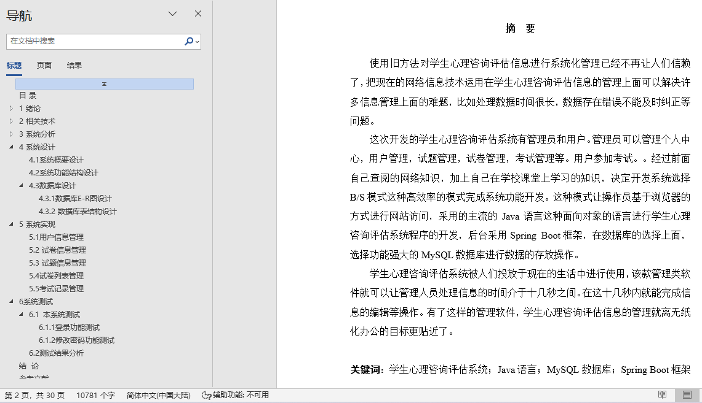
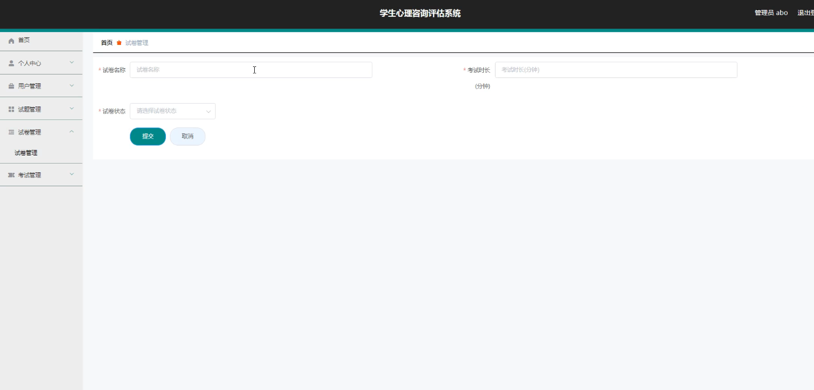
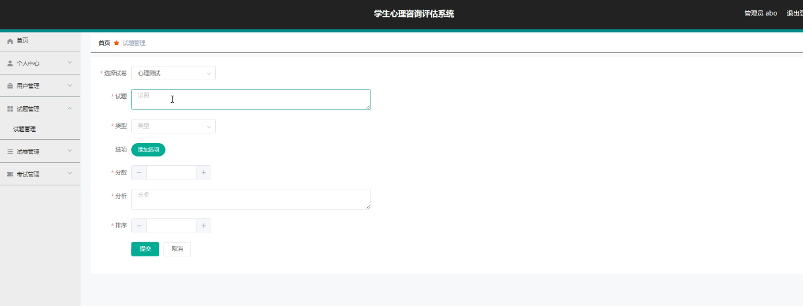
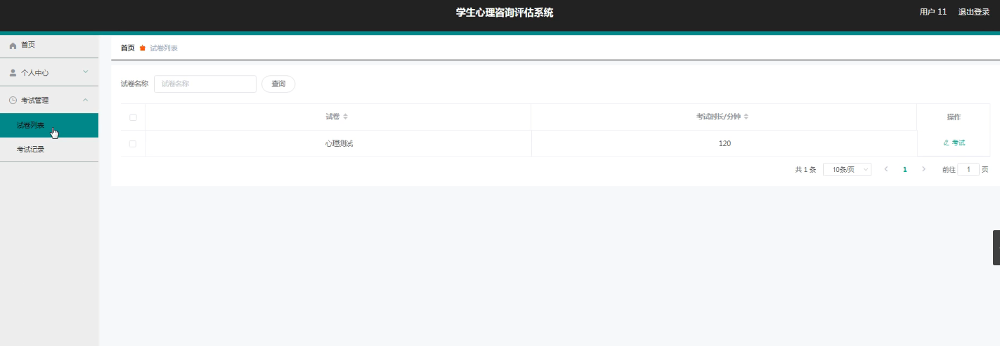
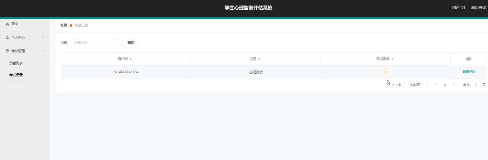
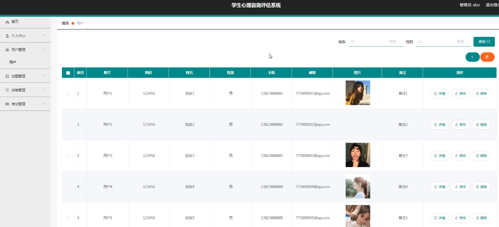

## 学生心理咨询评估系统(程序+报告)

###  获取sql数据库文件: 从戎源码网 (https://armycodes.com/) QQ: 386869957 QQ群: 377586148
###  所有系统地址: (https://github.com/YuLin-Coder/AllProjectCatalog) 
###  所有项目以及源代码本人均调试运行无问题 可支持远程安装部署调试、定制修改、代码讲解

## 项目介绍
学生心理咨询评估系统，系统包含两种角色：用户、管理员，系统分为前台和后台两大模块，主要功能如下：

1 用户信息管理
管理员功能: 管理员可以添加、修改、删除用户信息。
用户信息管理页面: 展示和操作用户信息的界面。
2 试卷信息管理
管理员功能: 管理员可以添加、修改、删除试卷信息。
试卷信息管理页面: 展示和操作试卷信息的界面。
3 试题信息管理
管理员功能: 管理员可以添加、修改、删除试题信息。
试题信息管理页面: 展示和操作试题信息的界面。
4 试卷列表管理
用户功能: 用户登录后可以查看试卷列表并进行参考考试。
试卷列表管理页面: 展示试卷列表和考试入口的界面。
5 考试记录管理
用户功能: 用户可以查看自己的考试记录。
考试记录管理页面: 展示用户考试记录的界面。

## 项目技术
- 编程语言：Java
- 数据库：MySQL
- 项目管理工具：Maven
- 前端技术：HTML、CSS、JavaScript、Vue
- 后端技术：Spring、SpringMVC、MyBatis

## 运行环境
- JDK版本：JDK1.8及以上
- 开发工具：IDEA、Ecplise、Myecplise都可以
- 数据库: MySQL5.7及以上
- Maven：maven3.0及以上
- Node：14.14.0及以上

## 运行截图

